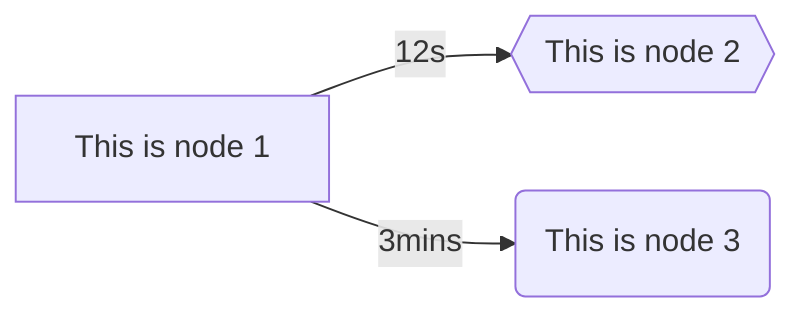
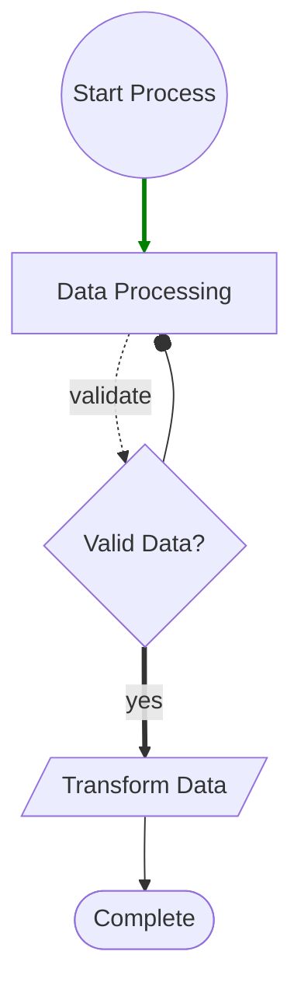

# MermaidDotNet
[](https://github.com/samsmithnz/MermaidDotNet/actions/workflows/workflow.yml)
[](https://coveralls.io/github/samsmithnz/MermaidDotNet?branch=main)
[](https://www.nuget.org/packages/MermaidDotNet/)
[](https://github.com/samsmithnz/MermaidDotNet/releases)

A comprehensive .NET wrapper to create [Mermaid](https://mermaid.js.org/syntax/flowchart.html) flowcharts with full syntax support, that can then be inserted into markdown or directly displayed in HTML with mermaid.js.

## Features

- **Directions**: LR (Left-Right), TD/TB (Top-Down/Top-Bottom), BT (Bottom-Top), RL (Right-Left)
- **Node Shapes**: Rectangle, Rounded, Stadium, Cylinder, Circle, Rhombus, Hexagon, Parallelogram, Trapezoid, TrapezoidAlt, Subroutine
- **Link Types**: Normal (--), Dotted (-.), Thick (==), Invisible (~~~)
- **Arrow Types**: Normal (>), Circle (o), Cross (x), Open (>)
- **Advanced Features**: CSS Classes, Click Actions, Bidirectional Links, Link Styling
- **Subgraphs**: Nested grouping with custom directions

## Basic Example

Very simple example, to create a Left->Right graph (LR), with two nodes linked. 
```csharp
    string direction = "LR";
    List<Node> nodes = new()
    {
        new("node1", "This is node 1"),
        new("node2", "This is node 2", Node.ShapeType.Hexagon),
        new("node3", "This is node 3", Node.ShapeType.Rounded)
    };
    List<Link> links = new()
    {
        new Link("node1", "node2", "12s"),
        new Link("node1", "node3", "3mins")
    };
    Flowchart flowchart = new(direction, nodes, links);
    string result = flowchart.CalculateFlowchart();
```
The resultant mermaid code is shown below - which can be inserted into markdown in GitHub ([blog announcement](https://github.blog/2022-02-14-include-diagrams-markdown-files-mermaid/))

```
flowchart LR
    node1[This is node 1]
    node2{{This is node 2}}
    node3(This is node 3)
    node1--12s-->node2
    node1--3mins-->node3
```

When rendered in mermaid, the graph looks like this:



## Advanced Example

Example with multiple node shapes, link types, arrow types, and styling:

```csharp
    string direction = "TD";
    List<Node> nodes = new()
    {
        new("start", "Start Process", Node.ShapeType.Circle, "startClass", "console.log('Started')"),
        new("process1", "Data Processing", Node.ShapeType.Rectangle),
        new("decision", "Valid Data?", Node.ShapeType.Rhombus),
        new("process2", "Transform Data", Node.ShapeType.Parallelogram),
        new("end2", "Complete", Node.ShapeType.Stadium)
    };
    List<Link> links = new()
    {
        new Link("start", "process1", "", null, false, Link.LinkType.Normal),
        new Link("process1", "decision", "validate", null, false, Link.LinkType.Dotted),
        new Link("decision", "process2", "yes", "stroke:green,stroke-width:3px", false, Link.LinkType.Thick),
        new Link("process2", "end2", "", null, false, Link.LinkType.Normal),
        new Link("decision", "process1", "", null, false, Link.LinkType.Normal, Link.ArrowType.Circle)
    };
    Flowchart flowchart = new(direction, nodes, links);
    string result = flowchart.CalculateFlowchart();
```

The advanced mermaid result:

```
flowchart TD
    start((Start Process))
    process1[Data Processing]
    decision{Valid Data?}
    process2[/Transform Data/]
    end2([Complete])
    start-->process1
    process1-.validate.->decision
    decision==yes==>process2
    process2-->end2
    decision--oprocess1
    linkStyle 0 stroke:green,stroke-width:3px
    class start startClass
    click start "console.log('Started')"
```

When rendered in mermaid, the advanced graph looks like this:


## It's also possible to insert into HTML and rendor on the web. Here is a sample, referencing the mermaid.js CDN.

```html
<h2>Production Graph</h2>
<body>
    Here is a mermaid diagram:
    <pre class="mermaid">
flowchart LR
    node1[This is node 1]
    node2{{This is node 2}}
    node3(This is node 3)
    node1--12s-->node2
    node1--3mins-->node3
    </pre>
    <script type="module">
        import mermaid from 'https://cdn.jsdelivr.net/npm/mermaid@10/dist/mermaid.esm.min.mjs';
        mermaid.initialize({ startOnLoad: true });
    </script>
</body>

## Sample Projects

### [MermaidDotNet.MVCWeb](src/MermaidDotNet.MVCWeb)

This is a sample ASP.NET Core MVC web application that demonstrates how to use the MermaidDotNet library to create and render Mermaid diagrams in an MVC web application. The project includes examples of creating flowcharts and rendering them using the Mermaid.js library.

### [MermaidDotNet.BlazorApp](src/MermaidDotNet.BlazorApp)

This is a sample Blazor application that demonstrates how to use the MermaidDotNet library to create and render Mermaid diagrams in a Blazor web application. The project includes examples of creating flowcharts and rendering them using the Mermaid.js library.
