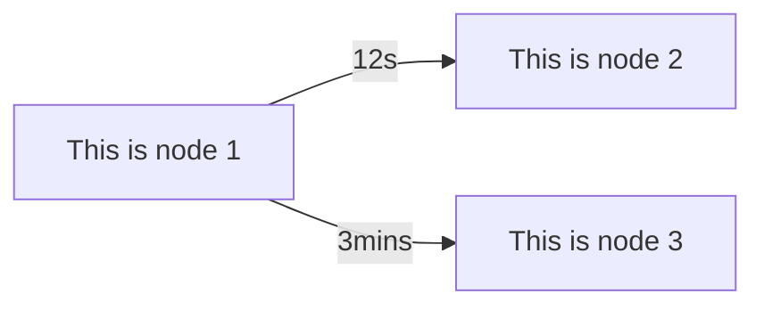

# MermaidDotNet
[](https://github.com/samsmithnz/MermaidDotNet/actions/workflows/workflow.yml)

Create flowcharts with .NET, and then render the Mermaid code that can then be inserted into markdown or directly displayed in HTML with mermaid.js

Very simple example, to create a Left->Right graph (LR), with two nodes linked. 
```csharp
    string direction = "LR";
    List<Node> nodes = new()
    {
        new("node1", "This is node 1"),
        new("node2", "This is node 2"),
        new("node3", "This is node 3")
    };
    List<Link> links = new()
    {
        new Link("node1", "node2", "12s"),
        new Link("node1", "node3", "3mins")
    };
    Flowchart flowchart = new(direction, nodes, links);
    string result = flowchart.CalculateFlowchart();
```

The mermaid result is:

```
flowchart LR
    node1[This is node 1]
    node2[This is node 2]
    node3[This is node 3]
    node1--12s-->node2
    node1--3mins-->node3
```

Which when rendered in mermaid, looks like this:

