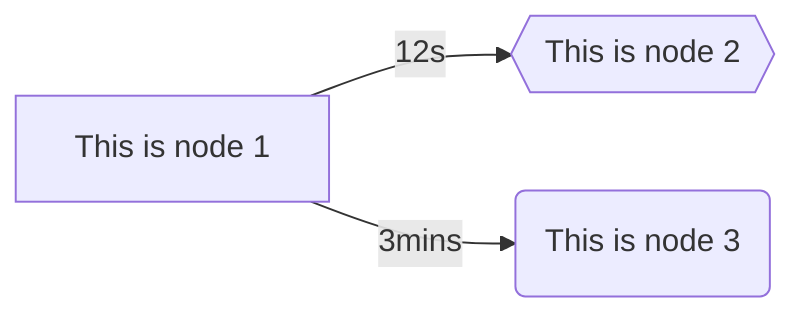

# MermaidDotNet
[](https://github.com/samsmithnz/MermaidDotNet/actions/workflows/workflow.yml)
[](https://coveralls.io/github/samsmithnz/MermaidDotNet?branch=main)
[](https://www.nuget.org/packages/MermaidDotNet/)
[](https://github.com/samsmithnz/MermaidDotNet/releases)

A .NET wrapper to create [Mermaid](https://mermaid.js.org/) code to render flowcharts, that can then be inserted into markdown or directly displayed in HTML with mermaid.js.

Very simple example, to create a Left->Right graph (LR), with two nodes linked. 
```csharp
    string direction = "LR";
    List<Node> nodes = new()
    {
        new("node1", "This is node 1"),
        new("node2", "This is node 2", Node.ShapeType.Hexagon),
        new("node3", "This is node 3", Node.ShapeType.Rounded)
    };
    List<Link> links = new()
    {
        new Link("node1", "node2", "12s"),
        new Link("node1", "node3", "3mins")
    };
    Flowchart flowchart = new(direction, nodes, links);
    string result = flowchart.CalculateFlowchart();
```

The mermaid result is below - which can be inserted into markdown in GitHub ([blog announcement](https://github.blog/2022-02-14-include-diagrams-markdown-files-mermaid/))

```
flowchart LR
    node1[This is node 1]
    node2{{This is node 2}}
    node3(This is node 3)
    node1--12s-->node2
    node1--3mins-->node3
```

Which when rendered in mermaid, looks like this:


It's also possible to insert into HTML and rendor on the web. Here is a sample, referencing the mermaid.js CDN.

```html
<h2>Production Graph</h2>
<body>
    Here is a mermaid diagram:
    <pre class="mermaid">
flowchart LR
    node1[This is node 1]
    node2{{This is node 2}}
    node3(This is node 3)
    node1--12s-->node2
    node1--3mins-->node3
    </pre>
    <script type="module">
        import mermaid from 'https://cdn.jsdelivr.net/npm/mermaid@10/dist/mermaid.esm.min.mjs';
        mermaid.initialize({ startOnLoad: true });
    </script>
</body>

## Sample Projects

### [MermaidDotNet.BlazorApp](src/MermaidDotNet.BlazorApp)

This is a sample Blazor application that demonstrates how to use the MermaidDotNet library to create and render Mermaid diagrams in a Blazor web application. The project includes examples of creating flowcharts and rendering them using the Mermaid.js library.

### [MermaidDotNet.MVCWeb](src/MermaidDotNet.MVCWeb)

This is a sample ASP.NET Core MVC web application that demonstrates how to use the MermaidDotNet library to create and render Mermaid diagrams in an MVC web application. The project includes examples of creating flowcharts and rendering them using the Mermaid.js library.
